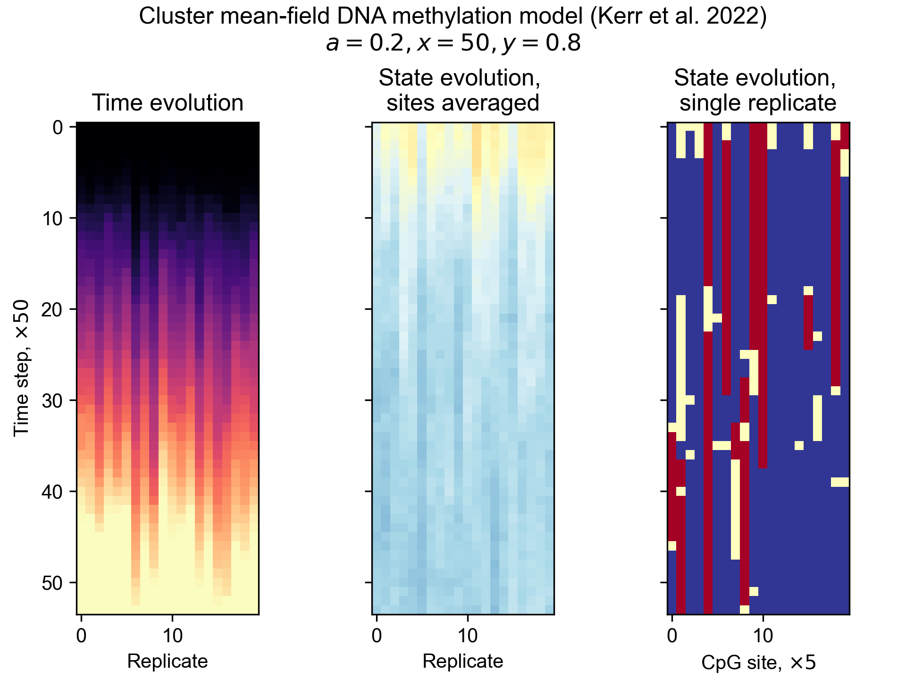

# Python implementation of Kerr's OPMF stochastic simulator

## Example usage

Simulate

```python
num_sites, num_replicates = 100, 20
nn_simulator = NNSim(num_sites, num_replicates, 0.2, 50, 0.8)

timespan = (0, 10)
cpgs, ts = nn_simulator.run(timespan, 10_000)
```

result

```python
import matplotlib.pyplot as plt

plt.rcParams['font.family'] = 'Arial'

fig, axs = plt.subplots(1, 3, constrained_layout=True, sharey=True, sharex=False)

slice_step = ts.shape[0] // 50

ax = axs[0]
ax.imshow(ts[::slice_step], cmap='magma', vmin=timespan[0], vmax=timespan[1])
ax.set_title('Time evolution')
ax.set_xlabel('Replicate')
ax.set_ylabel(r'Time step, $\times50$')

ax = axs[1]
ax.imshow(cpgs.mean(axis=1)[::slice_step], vmin=0, vmax=2, cmap='RdYlBu_r')
ax.set_title('State evolution, \nsites averaged')
ax.set_xlabel('Replicate')

ax = axs[2]
ax.imshow(cpgs[::slice_step, ::num_sites//num_replicates, 3], vmin=0, vmax=2, cmap='RdYlBu_r')
ax.set_title('State evolution, \nsingle replicate')
ax.set_xlabel(r'CpG site, $\times5$')

fig.suptitle('Cluster mean-field DNA methylation model (Kerr et al. 2022)\n'r'$a=0.2, x=50, y=0.8$')
```

